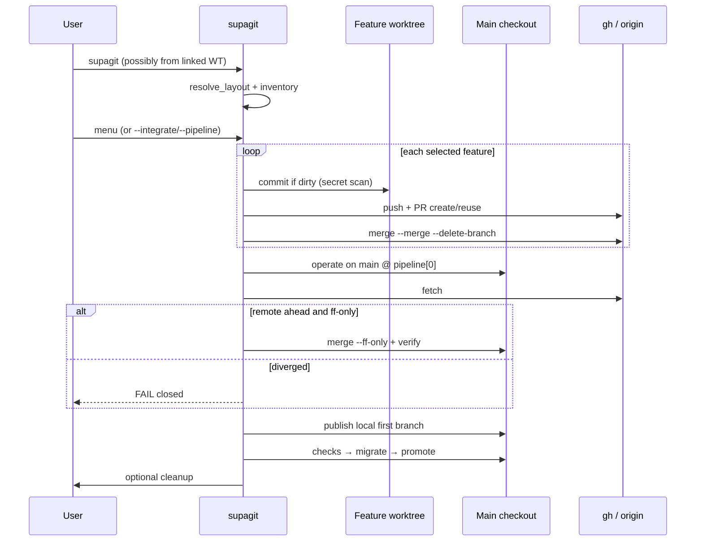

# Supagit Coche Escoba Implementation Plan

> **For agentic workers:** REQUIRED SUB-SKILL: Use superpowers:subagent-driven-development (recommended) or superpowers:executing-plans to implement this plan task-by-task. Steps use checkbox (`- [ ]`) syntax for tracking.

**Goal:** Turn `supagit` into a fail-closed “coche escoba” that inventaries messy Git state (worktrees, feature branches, stale remotes), lets the user pick what to integrate and the promotion order, merges selected work into the first pipeline branch via commit/push/PR, fast-forwards safely, then runs the existing checks → backend migrate → promote chain to production.

**Architecture:** Keep `Pipeline` as the orchestrator in `scripts/supagit.py`, but extract pure inventory/menu/sweep helpers into sibling modules installed next to it. New phases run before today’s publish/promote loop: resolve main vs linked worktree → inventory → interactive (or flag-driven) menu → sweep features via `gh` PR merge → ff-only sync of the first branch → existing pipeline. Cleanup remains optional after success.

**Tech Stack:** Python 3 stdlib only (`argparse`, `dataclasses`, `subprocess`, `unittest`), Git CLI, GitHub CLI (`gh`), existing Supabase CLI path unchanged.

## Global Constraints

- Fail-closed: stop on ambiguity, diverge, missing `gh` auth, secret paths, failed checks, failed migrations, or failed merges — never guess.
- No force-push, no rebase of shared branches, no `--admin` PR merges.
- Secrets policy unchanged: reuse `Pipeline._is_sensitive_path` / `_reject_sensitive_paths` before every commit.
- First pipeline branch dirty tree continues to use **direct** commit+push (current behavior). Non-first / feature branches always integrate via **PR + merge**.
- Menu-selected pipeline order is **run-scoped only** (does not rewrite `.supagit.json` in this plan).
- Launch from a linked worktree is allowed; promotion always executes in the **main** checkout.
- `--yes` requires explicit `--integrate` and `--pipeline` (and `-m` when a commit message is needed); otherwise error.
- Color policy unchanged: green confirmations/prompts, red warnings/errors/aborts.
- Tests use **unittest** (existing style), run via `python3 scripts/test_supagit.py` and `python3 scripts/test_supagit_sweep.py`.
- Installer must copy every new `scripts/supagit_*.py` module into `~/.agents/skills/supagit/` and include them in the staleness `cmp` checks.
- Product intent: non-expert users should recover from half-promoted work, stale branches, missed fetches, and forgotten backend migrations without hand-debugging Git.

### Locked product answers (proxy for the project owner)

These replace the previous “open questions”. Implementers must treat them as spec, not suggestions.

1. **Any selected feature branch** (worktree or not) integrates with the same path: commit if dirty → push → create/reuse PR → merge into `pipeline[0]`.
2. **Already contained in `pipeline[0]`:** show in the menu as contained; **exclude from default integrate list**; never open an empty PR unless the user explicitly selects it (then fail closed if there is nothing to merge).
3. **After successful PR merge:** `gh pr merge --merge --delete-branch` (delete **remote** feature branch). Local branch / worktree removal stays in **optional cleanup** only.
4. **`--no-sweep`:** skips feature menu/integrate/PR, but still does relocate-to-main + fetch + ff-only sync of `pipeline[0]`, then the classic publish→checks→promote flow.
5. **PR base branch** is always the first name in the **menu-selected** (or `--pipeline`) ordered list for this run.
6. **TTY defaults:** pressing Enter accepts `pipeline = config-resolved order` and `integrate = all local non-pipeline branches that are not already contained in pipeline[0]`.
7. **Hosts:** GitHub via `gh` only in this plan. Non-GitHub remotes fail closed with a clear error when a PR step is required.
8. **Final checkout:** main worktree on `pipeline[0]` after success (do not jump back into a feature worktree).

---

## File Structure

| File | Responsibility |
|---|---|
| `scripts/supagit.py` | CLI (`parse_args`/`main`), `Options`, `ShipError`/`UserAborted`, `Pipeline` orchestration, existing backend/promote logic, thin wrappers that call helpers |
| `scripts/supagit_layout.py` | Resolve launch root vs main root vs common git dir |
| `scripts/supagit_inventory.py` | Parse worktrees + local branches into dataclasses; containment/ahead/behind |
| `scripts/supagit_menu.py` | Render annotated menu; parse TTY / flag selections into `MenuSelection` |
| `scripts/supagit_sweep.py` | Commit-in-worktree, push, `GhClient` PR create/reuse/merge, ff-only sync + recovery, optional cleanup |
| `scripts/test_supagit.py` | Keep existing tests green; add Options/CLI regression tests as needed |
| `scripts/test_supagit_sweep.py` | New unit tests for layout/inventory/menu/ff/gh/cleanup pure helpers |
| `scripts/install-supagit-global.sh` | Install + staleness-check all new modules |
| `README.md` | User-facing sweeper behavior |
| `docs/supagit-agent-command.md` | Agent skill instructions (also installed as `SKILL.md`) |
| `.supagit.json.example` | Optional `sweep` block documentation |

Import rule for modules: at the top of `supagit.py` (and tests), ensure `Path(__file__).resolve().parent` is on `sys.path` so `import supagit_layout` works both from `scripts/` and from `~/.agents/skills/supagit/`.

---

## End-to-end phase order (target `Pipeline.run`)

```text
0. resolve_layout()
1. load config + resolve default pipeline branches (existing)
2. build_inventory()
3. if not --no-sweep: run_branch_menu() → MenuSelection
   else: MenuSelection(integrate=(), pipeline=config_branches)
4. apply_menu_selection(): set self.branches / self.dev from selection.pipeline
5. ensure_main_checkout_for_promotion()  # relocate ops to main_root
6. if integrate: sweep_features(selection)  # commit/push/PR/merge each
7. ff_sync_first_branch()
8. commit_and_publish_dev()  # existing, first branch only
9. run_checks + validate_clean_after_checks
10. confirm + migrate + promote chain (existing)
11. return_to_dev / ensure on pipeline[0] in main
12. optional_cleanup() if --cleanup or post-prompt yes
```



---

### Task 1: Repo layout + allow launch from linked worktree

**Files:**
- Create: `scripts/supagit_layout.py`
- Modify: `scripts/supagit.py` (`Pipeline.__init__`, `validate_workspace`, `_git_root`, `run_raw` default cwd)
- Modify: `scripts/install-supagit-global.sh` (install `supagit_layout.py`, add to `cmp` staleness list)
- Test: `scripts/test_supagit_sweep.py`

**Interfaces:**
- Consumes: `subprocess` Git calls; existing `ShipError`
- Produces:
  - `@dataclass(frozen=True) class RepoLayout: launch_root: Path; main_root: Path; common_dir: Path; is_linked_launch: bool`
  - `def resolve_repo_layout(cwd: Path | None = None) -> RepoLayout`
  - `Pipeline.layout: RepoLayout`
  - `Pipeline.root` becomes **main_root** for promotion operations
  - `Pipeline.launch_root: Path` preserved for messaging
  - `validate_workspace` no longer raises on linked worktree; instead records layout and later switches work to `main_root`

- [ ] **Step 1: Write the failing tests**

Create `scripts/test_supagit_sweep.py`:

```python
#!/usr/bin/env python3
from __future__ import annotations

import importlib.util
import subprocess
import sys
import tempfile
import unittest
from pathlib import Path

SCRIPTS = Path(__file__).resolve().parent
sys.path.insert(0, str(SCRIPTS))

import supagit_layout


def _run(cwd: Path, *args: str) -> str:
    completed = subprocess.run(
        args, cwd=cwd, text=True, stdout=subprocess.PIPE, stderr=subprocess.PIPE, check=True
    )
    return completed.stdout.strip()


class RepoLayoutTests(unittest.TestCase):
    def test_main_checkout_is_not_linked(self) -> None:
        with tempfile.TemporaryDirectory() as directory:
            root = Path(directory)
            _run(root, "git", "init", "-b", "dev")
            _run(root, "git", "config", "user.email", "t@example.com")
            _run(root, "git", "config", "user.name", "t")
            (root / "README").write_text("x\n", encoding="utf-8")
            _run(root, "git", "add", "README")
            _run(root, "git", "commit", "-m", "init")
            layout = supagit_layout.resolve_repo_layout(root)
            self.assertEqual(layout.launch_root, root.resolve())
            self.assertEqual(layout.main_root, root.resolve())
            self.assertFalse(layout.is_linked_launch)

    def test_linked_worktree_resolves_main_root(self) -> None:
        with tempfile.TemporaryDirectory() as directory:
            root = Path(directory) / "main"
            wt = Path(directory) / "wt"
            root.mkdir()
            _run(root, "git", "init", "-b", "dev")
            _run(root, "git", "config", "user.email", "t@example.com")
            _run(root, "git", "config", "user.name", "t")
            (root / "README").write_text("x\n", encoding="utf-8")
            _run(root, "git", "add", "README")
            _run(root, "git", "commit", "-m", "init")
            _run(root, "git", "branch", "feature/x")
            _run(root, "git", "worktree", "add", str(wt), "feature/x")
            layout = supagit_layout.resolve_repo_layout(wt)
            self.assertTrue(layout.is_linked_launch)
            self.assertEqual(layout.launch_root, wt.resolve())
            self.assertEqual(layout.main_root, root.resolve())


if __name__ == "__main__":
    unittest.main()
```

- [ ] **Step 2: Run tests to verify they fail**

Run: `python3 scripts/test_supagit_sweep.py -v`

Expected: FAIL with `ModuleNotFoundError: No module named 'supagit_layout'` (or import error).

- [ ] **Step 3: Implement `supagit_layout.py`**

```python
#!/usr/bin/env python3
from __future__ import annotations

import subprocess
from dataclasses import dataclass
from pathlib import Path


class LayoutError(RuntimeError):
    pass


@dataclass(frozen=True)
class RepoLayout:
    launch_root: Path
    main_root: Path
    common_dir: Path
    is_linked_launch: bool


def _git(cwd: Path, *args: str) -> str:
    completed = subprocess.run(
        ["git", *args],
        cwd=str(cwd),
        text=True,
        stdout=subprocess.PIPE,
        stderr=subprocess.PIPE,
    )
    if completed.returncode != 0:
        details = completed.stderr.strip() or "git failed"
        raise LayoutError(details)
    return completed.stdout.strip()


def resolve_repo_layout(cwd: Path | None = None) -> RepoLayout:
    start = (cwd or Path.cwd()).resolve()
    launch_root = Path(_git(start, "rev-parse", "--show-toplevel")).resolve()
    git_dir = Path(_git(launch_root, "rev-parse", "--git-dir"))
    if not git_dir.is_absolute():
        git_dir = (launch_root / git_dir).resolve()
    else:
        git_dir = git_dir.resolve()
    common_dir = Path(_git(launch_root, "rev-parse", "--git-common-dir"))
    if not common_dir.is_absolute():
        common_dir = (launch_root / common_dir).resolve()
    else:
        common_dir = common_dir.resolve()
    is_linked = git_dir != common_dir
    # main worktree root: parent of common_dir when common_dir ends with .git
    if common_dir.name == ".git":
        main_root = common_dir.parent
    else:
        # bare or unusual layouts — fail closed
        raise LayoutError(
            f"Unsupported git common dir layout: {common_dir}. "
            "supagit requires a normal non-bare repository."
        )
    return RepoLayout(
        launch_root=launch_root,
        main_root=main_root.resolve(),
        common_dir=common_dir,
        is_linked_launch=is_linked,
    )
```

- [ ] **Step 4: Wire into `Pipeline` and relax worktree rejection**

In `scripts/supagit.py`:

1. Insert `sys.path` bootstrap after imports:

```python
_SCRIPT_DIR = Path(__file__).resolve().parent
if str(_SCRIPT_DIR) not in sys.path:
    sys.path.insert(0, str(_SCRIPT_DIR))

import supagit_layout
```

2. In `Pipeline.__init__`, after options assignment:

```python
self.layout = supagit_layout.resolve_repo_layout()
self.launch_root = self.layout.launch_root
self.root = self.layout.main_root
```

Replace `_git_root()` usage for `self.root` accordingly (keep `_git_root` as thin wrapper calling layout if still referenced).

3. In `validate_workspace`, **delete** the block that raises `ShipError("This checkout is a linked worktree...")`. Replace with:

```python
if self.layout.is_linked_launch:
    print(
        f"Launch worktree: {self.launch_root}; promotion checkout: {self.root}"
    )
```

4. Keep the temporary requirement that promotion still starts once main is on `self.dev` — Task 5 will add `ensure_main_checkout_for_promotion`. For Task 1 only: if launch is linked, `validate_workspace` should **not** require `original_branch == self.dev` on the launch worktree; instead defer branch check to main after relocate (implement a flag `self._branch_check_on_main = True` when linked). Minimal Task 1 behavior:

```python
current_main = self.git("branch", "--show-current", capture=True, cwd=self.root).strip()
# Temporarily: still require main to already be on first branch; Task 5 will checkout.
if current_main != self.dev:
    raise ShipError(
        f"Main checkout must be on {self.dev} (currently {current_main or 'detached'}). "
        f"Launch path was {self.launch_root}."
    )
```

Add optional `cwd` to `run_raw` / `git` if not already used for main vs launch — `run_raw` already has `cwd=`. Default `cwd` must be `self.root` (main).

- [ ] **Step 5: Update installer**

In `scripts/install-supagit-global.sh`:

- `install -m 644` (or 755) `$repo_root/scripts/supagit_layout.py` → `$global_skill_dir/supagit_layout.py`
- Extend the generated launcher’s `cmp` staleness checks to include `supagit_layout.py`
- Extend the “source exists” file checks similarly

- [ ] **Step 6: Run tests to verify they pass**

Run:

```bash
python3 scripts/test_supagit_sweep.py -v
python3 scripts/test_supagit.py -v
```

Expected: PASS for layout tests; existing suite still PASS.

- [ ] **Step 7: Commit**

```bash
git add scripts/supagit_layout.py scripts/supagit.py scripts/test_supagit_sweep.py scripts/install-supagit-global.sh
git commit -m "$(cat <<'EOF'
feat: resolve main repo layout from linked worktrees

Allow launching supagit from a linked worktree by detecting the main
checkout via git-common-dir, while keeping promotion rooted there.
EOF
)"
```

---

### Task 2: Inventory of worktrees and local branches

**Files:**
- Create: `scripts/supagit_inventory.py`
- Modify: `scripts/install-supagit-global.sh` (install + cmp for new module)
- Test: `scripts/test_supagit_sweep.py`

**Interfaces:**
- Consumes: `RepoLayout`, Git porcelain output, pipeline branch tuple from config
- Produces:
  - `@dataclass(frozen=True) class WorktreeInfo: path: Path; branch: str | None; is_main: bool; dirty_paths: tuple[str, ...]`
  - `@dataclass(frozen=True) class BranchInfo: name: str; is_pipeline: bool; has_worktree: bool; worktree_path: Path | None; ahead: int; behind: int; contained_in_first: bool; upstream: str | None; dirty: bool`
  - `@dataclass(frozen=True) class RepoInventory: layout: RepoLayout; worktrees: tuple[WorktreeInfo, ...]; branches: tuple[BranchInfo, ...]; first_branch: str`
  - `def build_inventory(layout: RepoLayout, pipeline_branches: Sequence[str], remote: str, *, git_runner) -> RepoInventory`
  - Pure helpers: `parse_worktree_porcelain(text: str) -> list[dict]`, `branch_contained(needle: str, haystack: str, git_runner) -> bool`

`git_runner` signature used in tests:

```python
# Callable[..., str] compatible with a thin adapter around Pipeline.git
# Prefer: def run_git(*args: str, cwd: Path | None = None, capture: bool = True) -> str
```

- [ ] **Step 1: Write the failing tests**

Append to `scripts/test_supagit_sweep.py`:

```python
import supagit_inventory


class InventoryTests(unittest.TestCase):
    def test_parse_worktree_porcelain_lists_main_and_linked(self) -> None:
        text = """worktree /repo
HEAD abc
branch refs/heads/dev

worktree /repo-feature
HEAD def
branch refs/heads/feature/x
"""
        parsed = supagit_inventory.parse_worktree_porcelain(text)
        self.assertEqual(len(parsed), 2)
        self.assertEqual(parsed[0]["path"], "/repo")
        self.assertEqual(parsed[0]["branch"], "dev")
        self.assertEqual(parsed[1]["branch"], "feature/x")

    def test_feature_not_contained_is_integrable_default(self) -> None:
        with tempfile.TemporaryDirectory() as directory:
            root = Path(directory)
            _run(root, "git", "init", "-b", "dev")
            _run(root, "git", "config", "user.email", "t@example.com")
            _run(root, "git", "config", "user.name", "t")
            (root / "README").write_text("x\n", encoding="utf-8")
            _run(root, "git", "add", "README")
            _run(root, "git", "commit", "-m", "init")
            _run(root, "git", "checkout", "-b", "feature/x")
            (root / "README").write_text("y\n", encoding="utf-8")
            _run(root, "git", "add", "README")
            _run(root, "git", "commit", "-m", "feat")
            _run(root, "git", "checkout", "dev")

            layout = supagit_layout.resolve_repo_layout(root)

            def run_git(*args: str, cwd: Path | None = None, capture: bool = True) -> str:
                completed = subprocess.run(
                    ["git", *args],
                    cwd=str(cwd or root),
                    text=True,
                    stdout=subprocess.PIPE,
                    stderr=subprocess.PIPE,
                    check=True,
                )
                return completed.stdout if capture else ""

            inv = supagit_inventory.build_inventory(
                layout, ("dev", "pre", "prod"), "origin", run_git=run_git
            )
            names = {b.name: b for b in inv.branches}
            self.assertIn("feature/x", names)
            self.assertFalse(names["feature/x"].is_pipeline)
            self.assertFalse(names["feature/x"].contained_in_first)
```

- [ ] **Step 2: Run test to verify it fails**

Run: `python3 scripts/test_supagit_sweep.py InventoryTests -v`

Expected: FAIL (`No module named 'supagit_inventory'`).

- [ ] **Step 3: Implement `supagit_inventory.py`**

Implement parsing of `git worktree list --porcelain`, `git for-each-ref refs/heads --format=%(refname:short)`, per-branch:

- `ahead`/`behind` vs `@{upstream}` when upstream exists, else vs `remote/first` when that ref exists, else `(0,0)` with `upstream=None`
- `contained_in_first`: `git merge-base --is-ancestor <branch> <first>` (exit 0 ⇒ True)
- `dirty`: status porcelain in the worktree that has the branch checked out (main or linked); False if not checked out anywhere
- `is_pipeline`: name in `pipeline_branches`

Also export:

```python
def default_integrate_names(inventory: RepoInventory) -> tuple[str, ...]:
    return tuple(
        b.name
        for b in inventory.branches
        if not b.is_pipeline and not b.contained_in_first
    )
```

- [ ] **Step 4: Run tests to verify they pass**

Run: `python3 scripts/test_supagit_sweep.py -v`

Expected: PASS.

- [ ] **Step 5: Commit**

```bash
git add scripts/supagit_inventory.py scripts/test_supagit_sweep.py scripts/install-supagit-global.sh
git commit -m "$(cat <<'EOF'
feat: inventory worktrees and local branches for sweep

Build a structured view of pipeline vs feature branches, dirty
worktrees, and containment in the first pipeline branch.
EOF
)"
```

---

### Task 3: Branch menu (TTY + non-interactive flags)

**Files:**
- Create: `scripts/supagit_menu.py`
- Modify: `scripts/supagit.py` (`Options`, `parse_args`)
- Modify: `scripts/install-supagit-global.sh`
- Test: `scripts/test_supagit_sweep.py`

**Interfaces:**
- Consumes: `RepoInventory`, `default_integrate_names`
- Produces:
  - `@dataclass(frozen=True) class MenuSelection: integrate: tuple[str, ...]; pipeline: tuple[str, ...]`
  - `def render_branch_menu(inventory: RepoInventory) -> str`
  - `def parse_menu_responses(inventory: RepoInventory, pipeline_line: str, integrate_line: str) -> MenuSelection`
  - `def selection_from_flags(inventory: RepoInventory, pipeline_csv: str, integrate_csv: str) -> MenuSelection`
  - Replace `Options` with:

```python
@dataclass
class Options:
    dry_run: bool
    yes: bool
    config_path: Path | None
    message: str | None
    color: str
    no_sweep: bool = False
    integrate: str | None = None
    pipeline_order: str | None = None
    cleanup: bool | None = None  # True force, False skip, None prompt after success
```

Update every `Options(...)` construction in `scripts/test_supagit.py` to keep compiling (defaults cover old call sites if keyword-only extras stay defaulted; positional 5-arg calls remain valid).

CLI flags to add in `parse_args`:

```python
parser.add_argument("--no-sweep", action="store_true")
parser.add_argument("--integrate", help="Comma-separated feature branches, or 'none'")
parser.add_argument("--pipeline", dest="pipeline_order", help="Comma-separated ordered pipeline branches")
parser.add_argument("--cleanup", action="store_true", default=None)
parser.add_argument("--no-cleanup", action="store_true")
```

Resolve cleanup in `parse_args`:

```python
cleanup: bool | None
if args.no_cleanup:
    cleanup = False
elif args.cleanup:
    cleanup = True
else:
    cleanup = None
```

Grammar for TTY blank lines (= accept defaults):

- Empty `pipeline_line` → config/inventory pipeline order (the `is_pipeline` names in config order; if config list/legacy resolved names available, pass them into `parse_menu_responses` as `default_pipeline: Sequence[str]`)
- Empty `integrate_line` → `default_integrate_names(inventory)`
- `integrate: none` / `none` → empty integrate
- Numbers refer to the numbered menu list (1-based)
- Names also accepted (`feature/x`)
- Pipeline line must resolve to ≥1 unique existing local branches
- Integrate names must be local branches and must not appear in the chosen pipeline list

- [ ] **Step 1: Write the failing tests**

```python
import supagit_menu
from supagit_inventory import BranchInfo, RepoInventory, WorktreeInfo
from supagit_layout import RepoLayout


def _fake_inventory() -> RepoInventory:
    layout = RepoLayout(
        launch_root=Path("/repo"),
        main_root=Path("/repo"),
        common_dir=Path("/repo/.git"),
        is_linked_launch=False,
    )
    branches = (
        BranchInfo("dev", True, True, Path("/repo"), 0, 0, True, "origin/dev", False),
        BranchInfo("pre", True, False, None, 0, 0, False, "origin/pre", False),
        BranchInfo("prod", True, False, None, 0, 0, False, "origin/prod", False),
        BranchInfo("feature/x", False, True, Path("/wt"), 1, 0, False, None, True),
        BranchInfo("old", False, False, None, 0, 0, True, None, False),
    )
    return RepoInventory(layout, (), branches, "dev")


class MenuTests(unittest.TestCase):
    def test_defaults_skip_contained_features(self) -> None:
        inv = _fake_inventory()
        selection = supagit_menu.parse_menu_responses(
            inv, pipeline_line="", integrate_line="", default_pipeline=("dev", "pre", "prod")
        )
        self.assertEqual(selection.pipeline, ("dev", "pre", "prod"))
        self.assertEqual(selection.integrate, ("feature/x",))

    def test_numbers_reorder_pipeline_and_pick_features(self) -> None:
        inv = _fake_inventory()
        # render order will be listing order of inv.branches
        selection = supagit_menu.parse_menu_responses(
            inv,
            pipeline_line="1,3,2",
            integrate_line="4",
            default_pipeline=("dev", "pre", "prod"),
        )
        self.assertEqual(selection.pipeline, ("dev", "prod", "pre"))
        self.assertEqual(selection.integrate, ("feature/x",))

    def test_yes_mode_flags_parser(self) -> None:
        inv = _fake_inventory()
        selection = supagit_menu.selection_from_flags(inv, "dev,pre,prod", "feature/x")
        self.assertEqual(selection.integrate, ("feature/x",))

    def test_integrate_none(self) -> None:
        inv = _fake_inventory()
        selection = supagit_menu.parse_menu_responses(
            inv, "", "none", default_pipeline=("dev", "pre", "prod")
        )
        self.assertEqual(selection.integrate, ())
```

- [ ] **Step 2: Run tests to verify they fail**

Run: `python3 scripts/test_supagit_sweep.py MenuTests -v`

Expected: FAIL missing module.

- [ ] **Step 3: Implement `supagit_menu.py` + CLI Options**

Implement render + parsers. Raise a small `MenuError(RuntimeError)` for bad input; `Pipeline` maps it to `ShipError`.

Wire `Options` fields and argparse. Do **not** call the menu from `Pipeline.run` yet (Task 6).

- [ ] **Step 4: Run tests**

Run:

```bash
python3 scripts/test_supagit_sweep.py MenuTests -v
python3 scripts/test_supagit.py -v
```

Expected: PASS.

- [ ] **Step 5: Commit**

```bash
git add scripts/supagit_menu.py scripts/supagit.py scripts/test_supagit_sweep.py scripts/install-supagit-global.sh
git commit -m "$(cat <<'EOF'
feat: add branch menu selection for pipeline and features

Support TTY defaults and --integrate/--pipeline for non-interactive
sweeps while keeping contained branches out of the default set.
EOF
)"
```

---

### Task 4: Fast-forward sync of the first pipeline branch (with recovery)

**Files:**
- Create: start `scripts/supagit_sweep.py` with ff helpers only
- Modify: `scripts/install-supagit-global.sh`
- Test: `scripts/test_supagit_sweep.py`

**Interfaces:**
- Produces:
  - `@dataclass(frozen=True) class SyncResult: changed: bool; before: str; after: str`
  - `def ahead_behind(run_git, local: str, remote_ref: str) -> tuple[int, int]`  
    returns `(remote_only, local_only)` matching current `rev-list --left-right --count remote...local` semantics in `validate_workspace`
  - `def ff_sync_branch(run_git, branch: str, remote: str, *, dry_run: bool) -> SyncResult`

Algorithm (must match exactly):

```text
fetch refs/heads/<branch>
before = rev-parse <branch>
remote_ref = remote/<branch>  # after fetch of refs/remotes/remote/branch
remote_only, local_only = ahead_behind(branch, remote_ref)

if remote_only == 0:
    return SyncResult(False, before, before)  # nothing to ff
if local_only > 0:
    raise ShipError(diverge message)  # caller maps SweepError→ShipError
# remote_only > 0 and local_only == 0:
if dry_run: return SyncResult(True, before, "<remote>")
run: git checkout <branch> (if needed)
run: git merge --ff-only <remote_ref>
after = rev-parse <branch>
if after != rev-parse <remote_ref>:
    git reset --hard <before>
    raise failure
return SyncResult(True, before, after)

On merge exception:
    try git merge --abort if MERGE_HEAD exists
    git reset --hard <before>
    re-raise fail-closed
```

- [ ] **Step 1: Write the failing tests**

Use a temp repo with two clones or a file remote:

```python
import supagit_sweep


class FfSyncTests(unittest.TestCase):
    def test_ff_when_remote_ahead(self) -> None:
        with tempfile.TemporaryDirectory() as directory:
            remote = Path(directory) / "remote.git"
            local = Path(directory) / "local"
            _run(Path(directory), "git", "init", "--bare", str(remote))
            _run(Path(directory), "git", "clone", str(remote), str(local))
            _run(local, "git", "checkout", "-b", "dev")
            _run(local, "git", "config", "user.email", "t@example.com")
            _run(local, "git", "config", "user.name", "t")
            (local / "a").write_text("1\n", encoding="utf-8")
            _run(local, "git", "add", "a")
            _run(local, "git", "commit", "-m", "one")
            _run(local, "git", "push", "-u", "origin", "dev")

            other = Path(directory) / "other"
            _run(Path(directory), "git", "clone", str(remote), str(other))
            _run(other, "git", "checkout", "dev")
            _run(other, "git", "config", "user.email", "t@example.com")
            _run(other, "git", "config", "user.name", "t")
            (other / "a").write_text("2\n", encoding="utf-8")
            _run(other, "git", "add", "a")
            _run(other, "git", "commit", "-m", "two")
            _run(other, "git", "push", "origin", "dev")

            def run_git(*args: str, cwd: Path | None = None, capture: bool = True) -> str:
                completed = subprocess.run(
                    ["git", *args],
                    cwd=str(cwd or local),
                    text=True,
                    stdout=subprocess.PIPE,
                    stderr=subprocess.PIPE,
                )
                if completed.returncode != 0:
                    raise RuntimeError(completed.stderr)
                return completed.stdout.strip()

            result = supagit_sweep.ff_sync_branch(run_git, "dev", "origin", dry_run=False)
            self.assertTrue(result.changed)
            self.assertEqual(run_git("rev-parse", "dev"), run_git("rev-parse", "origin/dev"))

    def test_diverge_fails_closed(self) -> None:
        with tempfile.TemporaryDirectory() as directory:
            root = Path(directory)
            _run(root, "git", "init", "-b", "dev")
            _run(root, "git", "config", "user.email", "t@example.com")
            _run(root, "git", "config", "user.name", "t")
            (root / "a").write_text("1\n", encoding="utf-8")
            _run(root, "git", "add", "a")
            _run(root, "git", "commit", "-m", "base")
            _run(root, "git", "branch", "remote-dev")
            (root / "a").write_text("local\n", encoding="utf-8")
            _run(root, "git", "add", "a")
            _run(root, "git", "commit", "-m", "local")
            _run(root, "git", "checkout", "remote-dev")
            (root / "a").write_text("remote\n", encoding="utf-8")
            _run(root, "git", "add", "a")
            _run(root, "git", "commit", "-m", "remote")
            _run(root, "git", "update-ref", "refs/remotes/origin/dev", "remote-dev")
            _run(root, "git", "checkout", "dev")

            def run_git(*args: str, cwd: Path | None = None, capture: bool = True) -> str:
                completed = subprocess.run(
                    ["git", *args],
                    cwd=str(root),
                    text=True,
                    stdout=subprocess.PIPE,
                    stderr=subprocess.PIPE,
                )
                if completed.returncode != 0:
                    raise RuntimeError(completed.stderr)
                return completed.stdout.strip()

            with self.assertRaises(supagit_sweep.SweepError):
                supagit_sweep.ff_sync_branch(run_git, "dev", "origin", dry_run=False)
```

- [ ] **Step 2: Run tests to verify they fail**

Run: `python3 scripts/test_supagit_sweep.py FfSyncTests -v`

Expected: FAIL missing `supagit_sweep`.

- [ ] **Step 3: Implement ff helpers in `supagit_sweep.py`**

Include:

```python
class SweepError(RuntimeError):
    """Fail-closed sweep/sync error mapped to ShipError by Pipeline."""
```

- [ ] **Step 4: Run tests**

Expected: PASS.

- [ ] **Step 5: Commit**

```bash
git add scripts/supagit_sweep.py scripts/test_supagit_sweep.py scripts/install-supagit-global.sh
git commit -m "$(cat <<'EOF'
feat: add fail-closed fast-forward sync for first branch

Pull remote updates only with merge --ff-only, verify the tip, and
hard-reset back to the pre-sync tip if verification fails.
EOF
)"
```

---

### Task 5: Feature sweep via commit/push/PR/merge (`gh`)

**Files:**
- Modify: `scripts/supagit_sweep.py` (add `GhClient` + `integrate_branch`)
- Modify: `scripts/supagit.py` only if needed to expose `_reject_sensitive_paths` as a callable dependency
- Test: `scripts/test_supagit_sweep.py`

**Interfaces:**
- Produces:
  - `class GhClient:`
    - `def __init__(self, run_raw, *, dry_run: bool)`
    - `def ensure_ready(self) -> None` — runs `gh auth status`; raises `SweepError` if missing/unauthenticated
    - `def ensure_github_remote(self, remote_url: str) -> None` — require github.com (ssh or https)
    - `def find_open_pr(self, head: str, base: str) -> int | None`
    - `def create_pr(self, head: str, base: str, title: str) -> int`
    - `def merge_pr(self, number: int) -> None` — `gh pr merge <n> --merge --delete-branch`
  - `def commit_dirty_tree(run_git, *, cwd: Path, message: str, reject_sensitive, dry_run: bool) -> bool`  
    returns True if a commit was created; uses `git add -A`, secret scan on status + staged, `git diff --cached --check`, `git commit -m`
  - `def push_branch(run_git, remote: str, branch: str, *, cwd: Path, dry_run: bool) -> None`  
    uses `-u` when upstream missing
  - `def integrate_branch(run_git, *, gh: GhClient, remote: str, remote_url: str, branch: str, base: str, cwd: Path, message_provider: Callable[[], str], reject_sensitive: Callable[[Sequence[str]], None], dry_run: bool, contained_in_first: bool) -> None`  
    full path: commit if dirty → push → ensure gh → reuse/create PR → merge → fetch base

Rules:

- If branch has a worktree path, **all git write ops for that branch** use `cwd=worktree`.
- If the feature is clean and not checked out anywhere, push from main root with `git push <remote> <branch>:<branch>` without checking it out. PR merge updates remote base; local base is updated later by `ff_sync_branch`.
- If explicitly selected but `contained_in_first` is True → `SweepError("nothing to integrate")`.
- No direct `git merge` of feature into base as fallback.

- [ ] **Step 1: Write the failing tests (mocked gh)**

```python
from typing import Callable, Sequence


class GhClientTests(unittest.TestCase):
    def test_ensure_ready_fails_when_gh_missing(self) -> None:
        def run_raw(cmd, **kwargs):
            raise FileNotFoundError("gh")

        client = supagit_sweep.GhClient(run_raw, dry_run=False)
        with self.assertRaises(supagit_sweep.SweepError):
            client.ensure_ready()

    def test_ensure_github_remote_rejects_non_github(self) -> None:
        client = supagit_sweep.GhClient(lambda *a, **k: "", dry_run=False)
        with self.assertRaises(supagit_sweep.SweepError):
            client.ensure_github_remote("git@gitlab.com:acme/demo.git")


class IntegrateBranchTests(unittest.TestCase):
    def test_reuses_existing_pr_and_merges(self) -> None:
        actions: list[str] = []

        class FakeGh:
            def ensure_ready(self) -> None:
                actions.append("auth")

            def ensure_github_remote(self, remote_url: str) -> None:
                actions.append(f"remote:{remote_url}")

            def find_open_pr(self, head: str, base: str) -> int | None:
                actions.append(f"find:{head}->{base}")
                return 7

            def create_pr(self, head: str, base: str, title: str) -> int:
                raise AssertionError("should reuse")

            def merge_pr(self, number: int) -> None:
                actions.append(f"merge:{number}")

        def run_git(*args, cwd=None, capture=True):
            actions.append("git:" + " ".join(args))
            if args[:2] == ("status", "--porcelain"):
                return ""
            if args[0] == "push":
                return ""
            if args[:1] == ("fetch",):
                return ""
            return "ok"

        supagit_sweep.integrate_branch(
            run_git,
            gh=FakeGh(),
            remote="origin",
            remote_url="git@github.com:acme/demo.git",
            branch="feature/x",
            base="dev",
            cwd=Path("/wt"),
            message_provider=lambda: "should not be called",
            reject_sensitive=lambda paths: None,
            dry_run=False,
            contained_in_first=False,
        )
        self.assertEqual(actions[0], "auth")
        self.assertIn("merge:7", actions)

    def test_contained_branch_fails_closed(self) -> None:
        class FakeGh:
            def ensure_ready(self) -> None:
                return None

            def ensure_github_remote(self, remote_url: str) -> None:
                return None

            def find_open_pr(self, head: str, base: str) -> int | None:
                return None

            def create_pr(self, head: str, base: str, title: str) -> int:
                raise AssertionError("should not create")

            def merge_pr(self, number: int) -> None:
                raise AssertionError("should not merge")

        with self.assertRaises(supagit_sweep.SweepError):
            supagit_sweep.integrate_branch(
                lambda *a, **k: "",
                gh=FakeGh(),
                remote="origin",
                remote_url="git@github.com:acme/demo.git",
                branch="old",
                base="dev",
                cwd=Path("/repo"),
                message_provider=lambda: "x",
                reject_sensitive=lambda paths: None,
                dry_run=False,
                contained_in_first=True,
            )
```

Also test secret rejection short-circuits before commit.

- [ ] **Step 2: Run tests to verify they fail**

Run: `python3 scripts/test_supagit_sweep.py GhClientTests IntegrateBranchTests -v`

Expected: FAIL on missing functions.

- [ ] **Step 3: Implement GhClient + integrate_branch**

`merge_pr` command:

```python
["gh", "pr", "merge", str(number), "--merge", "--delete-branch"]
```

`create_pr`:

```python
["gh", "pr", "create", "--base", base, "--head", head, "--title", title, "--body", body]
```

Body constant:

```text
Integrated by supagit sweeper.
```

Title default: `supagit: integrate {head} into {base}`.

- [ ] **Step 4: Run tests**

Expected: PASS.

- [ ] **Step 5: Commit**

```bash
git add scripts/supagit_sweep.py scripts/test_supagit_sweep.py scripts/install-supagit-global.sh
git commit -m "$(cat <<'EOF'
feat: integrate feature branches through GitHub PR merge

Commit and push dirty feature worktrees, reuse or open a PR into the
first pipeline branch, merge with --merge --delete-branch, and fail
closed without a local-merge fallback.
EOF
)"
```

---

### Task 6: Orchestrate sweeper phases inside `Pipeline.run`

**Files:**
- Modify: `scripts/supagit.py` (`Options` usage, `validate_workspace`, new methods, `run`)
- Test: `scripts/test_supagit_sweep.py` (orchestration unit tests with heavy mocking) + keep `scripts/test_supagit.py` green

**Interfaces:**
- Produces on `Pipeline`:
  - `def build_inventory(self) -> RepoInventory`
  - `def run_branch_menu(self, inventory: RepoInventory) -> MenuSelection`
  - `def apply_menu_selection(self, selection: MenuSelection) -> None` — sets `self.branches`, `self.dev`, `self.pre`, `self.prod`
  - `def ensure_main_checkout_for_promotion(self) -> None` — `cwd=self.root`; if not on `self.dev` and tree clean, `git checkout self.dev`; if dirty on wrong branch → `ShipError`
  - `def sweep_features(self, selection: MenuSelection, inventory: RepoInventory) -> None`
  - `def ff_sync_first_branch(self) -> None`
  - Updated `run()` phase order as in the phase list above
  - Replace old “remote ahead ⇒ hard fail” in `validate_workspace` with fetch + note that ff_sync will handle ahead-only; **still fail in validate_workspace only on diverge** if you can detect it early, or leave diverge exclusively to `ff_sync_first_branch` (prefer single place: `ff_sync_first_branch`)

`--no-sweep` path:

```python
selection = MenuSelection(integrate=(), pipeline=tuple(self.branches))
```

still runs layout relocate + `ff_sync_first_branch`.

`--yes` rules:

```python
if self.options.yes and not self.options.no_sweep:
    if self.options.integrate is None or self.options.pipeline_order is None:
        raise ShipError(
            "With --yes, provide --integrate (or --integrate none) and --pipeline, "
            "or pass --no-sweep."
        )
```

TTY menu prompts (green via `self.prompt`):

```text
Pipeline order (numbers/names, empty = default dev→pre→prod): 
Integrate features (numbers/names, empty = default, 'none' = skip): 
```

Then `self.confirm` a rendered plan summary before mutating.

Dry-run: menu still runs (or flags); integrate/ff/promote call helpers with `dry_run=True` (already how mutating commands work).

- [ ] **Step 1: Write orchestration tests with mocks**

```python
# In scripts/test_supagit_sweep.py — import Pipeline via importlib like test_supagit.py
SPEC = importlib.util.spec_from_file_location("supagit_engine", SCRIPTS / "supagit.py")
assert SPEC and SPEC.loader
ENGINE = importlib.util.module_from_spec(SPEC)
sys.modules[SPEC.name] = ENGINE
SPEC.loader.exec_module(ENGINE)


class OrchestrationTests(unittest.TestCase):
    def test_yes_without_flags_fails(self) -> None:
        pipeline = ENGINE.Pipeline.__new__(ENGINE.Pipeline)
        pipeline.options = ENGINE.Options(
            dry_run=False,
            yes=True,
            config_path=None,
            message=None,
            color="never",
            no_sweep=False,
            integrate=None,
            pipeline_order=None,
            cleanup=None,
        )
        with self.assertRaisesRegex(ENGINE.ShipError, "--integrate"):
            pipeline._require_noninteractive_selection()

    def test_yes_with_no_sweep_ok(self) -> None:
        pipeline = ENGINE.Pipeline.__new__(ENGINE.Pipeline)
        pipeline.options = ENGINE.Options(
            dry_run=False,
            yes=True,
            config_path=None,
            message=None,
            color="never",
            no_sweep=True,
            integrate=None,
            pipeline_order=None,
            cleanup=False,
        )
        pipeline._require_noninteractive_selection()  # must not raise
```

Add `Pipeline._require_noninteractive_selection(self) -> None` as a tiny testable method that encodes the `--yes` rules above.

- [ ] **Step 2: Run tests to verify fail/pass cycle**

Implement method until PASS.

- [ ] **Step 3: Rewrite `Pipeline.run`**

```python
def run(self) -> None:
    self.validate_workspace()
    inventory = self.build_inventory()
    if self.options.no_sweep:
        selection = MenuSelection(integrate=(), pipeline=tuple(self.branches))
    else:
        selection = self.run_branch_menu(inventory)
    self.apply_menu_selection(selection)
    self.ensure_main_checkout_for_promotion()
    if selection.integrate:
        self.sweep_features(selection, inventory)
    self.ff_sync_first_branch()
    self.commit_and_publish_dev()
    self._assert_dev_synced()
    self.run_checks()
    self.validate_clean_after_checks()
    self.confirm(f"Start the complete {' → '.join(self.branches)} pipeline?")
    if self.backend.provider == "none":
        print("\n=== BACKEND NONE: database migration skipped ===")
    for index, (source, target) in enumerate(zip(self.branches, self.branches[1:]), start=1):
        project_ref = self._backend_target_for_branch(target, index)
        if self.backend.provider == "supabase" and project_ref:
            self.database_checkpoint(target, project_ref)
        elif self.backend.provider == "supabase":
            print(f"No database migration target configured for branch {target}; skipping checkpoint.")
        self.promote(source, target)
    self.return_to_dev()
    self.optional_cleanup(inventory, selection)  # Task 7 may stub as no-op
    if not self.options.dry_run:
        self.validate_workspace()
    self.status(
        f"\nPipeline completed: {' → '.join(self.branches)}. Final checkout: {self.dev}.",
        self.GREEN,
    )
```

Stub `optional_cleanup` as `pass` until Task 7.

Update `validate_workspace` to remove hard fail on remote-only ahead (ff sync owns it). Keep unpublished local-ahead messaging.

- [ ] **Step 4: Run full unit suites**

```bash
python3 scripts/test_supagit.py -v
python3 scripts/test_supagit_sweep.py -v
```

Expected: PASS.

- [ ] **Step 5: Manual dry-run smoke (on this repo or a toy clone)**

```bash
scripts/supagit --dry-run --no-sweep
scripts/supagit --dry-run --integrate none --pipeline dev,pre,prod
```

Expected: prints plan, no mutations.

- [ ] **Step 6: Commit**

```bash
git add scripts/supagit.py scripts/test_supagit_sweep.py
git commit -m "$(cat <<'EOF'
feat: orchestrate sweeper phases before promotion

Inventory and menu-driven feature integration now run before
fast-forward sync, publish, checks, and the promotion chain.
EOF
)"
```

---

### Task 7: Optional cleanup after success

**Files:**
- Modify: `scripts/supagit_sweep.py` (`plan_cleanup`, `apply_cleanup`)
- Modify: `scripts/supagit.py` (`optional_cleanup`)
- Test: `scripts/test_supagit_sweep.py`

**Interfaces:**
- Produces:
  - `@dataclass(frozen=True) class CleanupItem: kind: str; name: str; path: Path | None`  
    `kind in {"local-branch", "worktree"}`
  - `@dataclass(frozen=True) class CleanupPlan: items: tuple[CleanupItem, ...]`
  - `def plan_cleanup(inventory: RepoInventory, pipeline: Sequence[str], merged_features: Sequence[str]) -> CleanupPlan`  
    include local feature branches that are contained in `pipeline[0]` (or listed in `merged_features`) and are not pipeline names; include worktrees whose branch is in that set and dirty_paths empty
  - `def apply_cleanup(run_git, plan: CleanupPlan, *, dry_run: bool) -> None`  
    `git worktree remove <path>` then `git branch -d <name>` (force `-D` **forbidden**)

`Pipeline.optional_cleanup`:

```python
def optional_cleanup(self, inventory, selection) -> None:
    if self.options.cleanup is False:
        return
    plan = supagit_sweep.plan_cleanup(inventory, selection.pipeline, selection.integrate)
    if not plan.items:
        print("Cleanup: nothing safe to remove.")
        return
    print("Cleanup candidates:")
    for item in plan.items:
        print(f"  - {item.kind}: {item.name} {item.path or ''}")
    if self.options.cleanup is None:
        self.confirm("Apply optional cleanup of merged features/worktrees?")
    elif self.options.yes and self.options.cleanup is True:
        pass  # already authorized
    supagit_sweep.apply_cleanup(self._git_adapter, plan, dry_run=self.options.dry_run)
```

Never delete pipeline branches. Never delete dirty worktrees. Never delete unmerged branches (`branch -d` fails ⇒ surface error).

- [ ] **Step 1: Write failing tests for plan_cleanup**

```python
class CleanupTests(unittest.TestCase):
    def test_plan_skips_pipeline_and_dirty_worktrees(self) -> None:
        layout = RepoLayout(
            launch_root=Path("/repo"),
            main_root=Path("/repo"),
            common_dir=Path("/repo/.git"),
            is_linked_launch=False,
        )
        worktrees = (
            WorktreeInfo(Path("/repo"), "dev", True, ()),
            WorktreeInfo(Path("/wt-dirty"), "feature/x", False, ("a.txt",)),
            WorktreeInfo(Path("/wt-clean"), "feature/y", False, ()),
        )
        branches = (
            BranchInfo("dev", True, True, Path("/repo"), 0, 0, True, "origin/dev", False),
            BranchInfo("pre", True, False, None, 0, 0, False, "origin/pre", False),
            BranchInfo("prod", True, False, None, 0, 0, False, "origin/prod", False),
            BranchInfo("feature/x", False, True, Path("/wt-dirty"), 0, 0, True, None, True),
            BranchInfo("feature/y", False, True, Path("/wt-clean"), 0, 0, True, None, False),
        )
        inv = RepoInventory(layout, worktrees, branches, "dev")
        plan = supagit_sweep.plan_cleanup(inv, ("dev", "pre", "prod"), ("feature/x", "feature/y"))
        kinds = {(i.kind, i.name) for i in plan.items}
        self.assertNotIn(("local-branch", "dev"), kinds)
        self.assertNotIn(("worktree", "feature/x"), kinds)  # dirty
        self.assertIn(("worktree", "feature/y"), kinds)
        self.assertIn(("local-branch", "feature/y"), kinds)
```

- [ ] **Step 2: Implement + pass tests**

- [ ] **Step 3: Commit**

```bash
git add scripts/supagit_sweep.py scripts/supagit.py scripts/test_supagit_sweep.py
git commit -m "$(cat <<'EOF'
feat: optional cleanup of merged feature branches and worktrees

After a successful pipeline, offer safe deletion of merged local
feature branches and clean worktrees without touching pipeline refs.
EOF
)"
```

---

### Task 8: Docs, example config, agent skill, installer completeness

**Files:**
- Modify: `README.md`
- Modify: `docs/supagit-agent-command.md`
- Modify: `.supagit.json.example`
- Modify: `scripts/install-supagit-global.sh` (final audit: all `supagit_*.py` installed + cmp’d)
- No new runtime behavior

**Docs content that must be stated explicitly:**

1. `supagit` may start from a linked worktree.
2. Sweeper menu selects feature integrates + pipeline order for this run.
3. Features go through GitHub PR merge into the first pipeline branch; `gh` required for that path.
4. `--no-sweep` still relocates + ff-only syncs.
5. `--integrate` / `--pipeline` required with `--yes` unless `--no-sweep`.
6. `--cleanup` / `--no-cleanup`.
7. Agent instructions: measure layout, worktrees, status; run `--dry-run` first; confirm with user.

Optional example config block:

```json
"sweep": {
  "pr_merge_method": "merge",
  "require_gh": true
}
```

Reading this block is optional in code for this plan; if absent, behave as merge + require_gh. If you wire reading, unknown `pr_merge_method` values fail closed.

- [ ] **Step 1: Update `docs/supagit-agent-command.md`** with the new phase order and measurement requirements (worktrees, `gh auth status`, menu flags).

- [ ] **Step 2: Update `README.md` Running / safety sections** with sweeper flags and behavior.

- [ ] **Step 3: Update `.supagit.json.example`** with optional `sweep` block commented in prose in README if JSON cannot comment — put the example in README and a live optional key in the example file.

- [ ] **Step 4: Audit installer** copies:

```text
supagit.py
supagit
supagit_layout.py
supagit_inventory.py
supagit_menu.py
supagit_sweep.py
docs/supagit-agent-command.md → SKILL.md
```

and all are part of staleness `cmp`.

- [ ] **Step 5: Re-run unit tests**

```bash
python3 scripts/test_supagit.py -v
python3 scripts/test_supagit_sweep.py -v
```

- [ ] **Step 6: Commit**

```bash
git add README.md docs/supagit-agent-command.md .supagit.json.example scripts/install-supagit-global.sh
git commit -m "$(cat <<'EOF'
docs: document sweeper flow and install companion modules

Explain worktree launch, menu flags, gh PR integration, and keep the
global installer in sync with the new Python modules.
EOF
)"
```

---

## Self-review (author checklist)

### Spec coverage

| Requirement | Task |
|---|---|
| Menu shows pipeline + non-pipeline locals; choose integrates + pipeline order | Task 3, 6 |
| Worktree dirty → commit+push+PR+merge into first | Task 5, 6 |
| Feature without worktree same PR path | Task 5 |
| Contained features excluded from defaults | Task 2, 3 |
| Remote ahead → ff-only with recovery; diverge fails | Task 4, 6 |
| Cleanup optional | Task 7 |
| Launch from linked worktree | Task 1, 6 |
| `--no-sweep` still relocate + ff | Task 6 |
| PR base = selected pipeline[0] | Task 5, 6 |
| Remote feature branch deleted on PR merge | Task 5 |
| Secrets block commits | Task 5 (reuse reject) |
| Backend migrate + promote preserved | Task 6 (existing loop) |
| Docs/skill/installer | Task 8 |
| `--yes` fail-closed without flags | Task 3, 6 |

### Placeholder scan

No TBD/TODO steps. Each task has concrete tests, commands, and commit messages.

### Type consistency

- `RepoLayout`, `RepoInventory`, `BranchInfo`, `WorktreeInfo`, `MenuSelection`, `SyncResult`, `CleanupPlan`, `CleanupItem`, `SweepError`, `GhClient` names are stable across tasks.
- `Options` fields: `no_sweep`, `integrate`, `pipeline_order`, `cleanup`.
- `Pipeline.root` = main_root; `Pipeline.launch_root` = launch path.

### Explicit non-goals (do not implement in this plan)

- GitLab/Bitbucket PR providers
- Persisting menu order into `.supagit.json`
- Squash/rebase merge methods
- Auto-resolving merge conflicts
- Recreating missing local branches from remote-only tips (unless already present locally)
- Fancy TUI (fzf/curses)
- Force-deleting unmerged branches

---

## Execution handoff

Plan complete and saved to `docs/superpowers/plans/2026-08-09-supagit-coche-escoba.md`.

**Two execution options:**

1. **Subagent-Driven (recommended)** — dispatch a fresh subagent per task, review between tasks, fast iteration  
2. **Inline Execution** — execute tasks in this session using executing-plans, batch execution with checkpoints  

Which approach?
